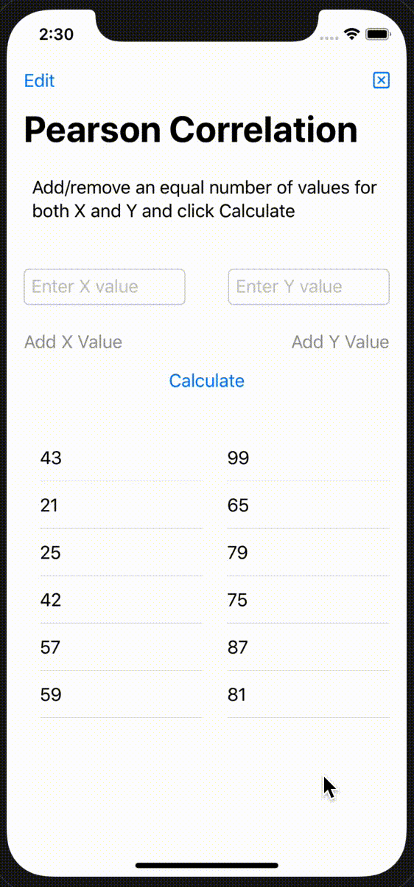

# 100Apps-16PCC

App 16 of my 100 App Challenge - https://github.com/Whoopinstick/100AppsChallenge

16 - 16 - Pearson's Correlation Coefficients

Written in Swift / SwiftUI
  formula example from https://www.statisticshowto.com/probability-and-statistics/correlation-coefficient-formula/

